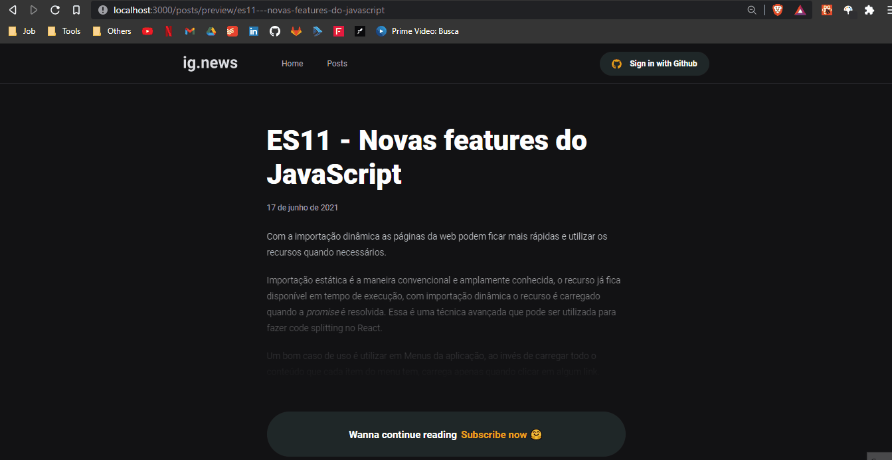

<h1 align="center">
  
</h1>

<p align="center">
  <a href="#description">Description</a>&nbsp;&nbsp;&nbsp;|&nbsp;&nbsp;&nbsp;
  <a href="#requirements">Requirements</a>&nbsp;&nbsp;&nbsp;|&nbsp;&nbsp;&nbsp;
  <a href="#technologies">Technologies</a>&nbsp;&nbsp;&nbsp;|&nbsp;&nbsp;&nbsp;
  <a href="#layout">Layout</a>&nbsp;&nbsp;&nbsp;|&nbsp;&nbsp;&nbsp;
  <a href="#usage">Usage</a>&nbsp;&nbsp;&nbsp;|&nbsp;&nbsp;&nbsp;
  <a href="#demonstration">Demonstration</a>
</p>
<br />
<p align="center">
  
  
  
  
  
  
  
</p>

<p align="center">
  <a href="https://github.com/Lissone/ignews/issues">Report bug</a>
  ·
  <a href="https://github.com/Lissone/ignews/issues">Request feature</a>
</p>

<br />

## Description

A news blog with no backend. A JAM Stack application that uses paid subscription by users authenticated by github using stripe and prismic CMS to control publications. 

Developed as a challenge to deepen my knowledge of CMS and JAM Stack applications.

## Requirements

- [Nodejs](https://nodejs.org/en/)
- [Npm](https://www.npmjs.com/)
- [Yarn](https://yarnpkg.com/)
- [StripeCli](https://stripe.com/docs/stripe-cli) (For local stripe testing)

## Technologies

- React
- NextJs
- Typescript
- Sass
- FaunaDB
- Stripe
- Prismic CMS
- Next Auth

## Layout

You can view the project layout via this <a href="https://www.figma.com/file/ir9xJAYRMR1nUlMSmyHj8B/ig.news?node-id=1%3A2" target="_blank">link</a>.

## Usage

You can clone it on your pc using the command:

```bash
git clone https://github.com/Lissone/ignews.git
cd ignews
```

Install dependencies using:

```bash
yarn
#or
npm install
```

Need to add environment variables:

```bash
# .\.env.local

# Stripe
STRIPE_API_KEY=
NEXT_PUBLIC_STRIPE_PUBLIC_KEY=
STRIPE_WEBHOOK_SECRET=
STRIPE_SUCCESS_URL=http://localhost:3000/posts
STRIPE_CANCEL_URL=http://localhost:3000

# Github
GITHUB_CLIENT_ID=
GITHUB_CLIENT_SECRET=

# FaunaDB
FAUNADB_KEY=

# Primisc CMS
PRISMIC_ENDPOINT=
PRISMIC_ACCESS_TOKEN=
```

Commands used to use stripe webhooks locally:

```bash
./stripe.exe login

./stripe.exe listen --forward-to localhost:3000/api/webhooks
```

Run application:

```bash
yarn dev
#or
npm run dev
```

## Demonstration



## License

Distributed under the MIT License. See `LICENSE` for more information.

<h4 align="center">
  Made with ❤️ by <a href="https://github.com/Lissone" target="_blank">Lissone</a>
</h4>

<hr />
